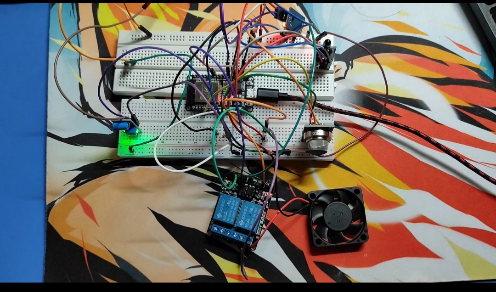
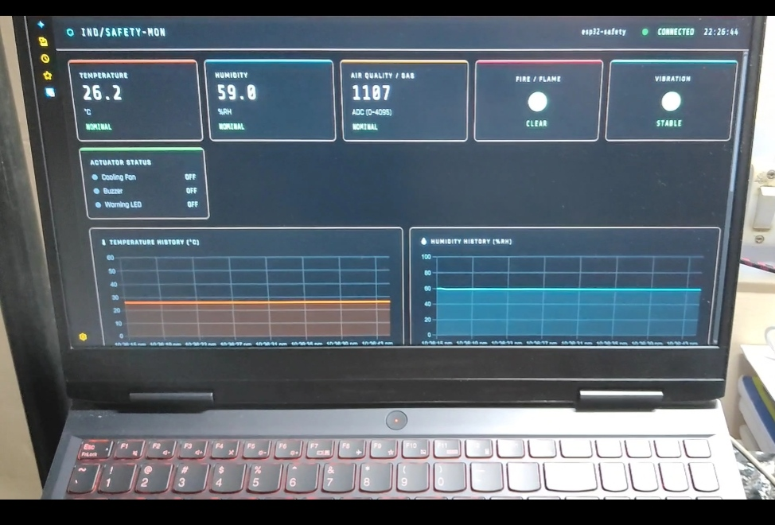

## Smart Industrial Safety & Equipment Monitoring System
## ESP32 + WiFi WebSocket Dashboard — Complete Project Guide

---

## Table of Contents

1. [Project Overview](#1-project-overview)
2. [Features](#2-features)
3. [Hardware Required](#3-hardware-required)
4. [Circuit & Wiring Connections](#4-circuit--wiring-connections)
5. [Relay (JQC3F) Wiring Detail](#5-relay-jqc3f-wiring-detail)
6. [Project Folder Structure](#6-project-folder-structure)
7. [Files to Edit Before Running](#7-files-to-edit-before-running)
8. [Software Prerequisites](#8-software-prerequisites)
9. [Step-by-Step Setup & Execution](#9-step-by-step-setup--execution)
10. [Using the Dashboard](#10-using-the-dashboard)
11. [Threshold Configuration](#11-threshold-configuration)
12. [Sensor Calibration Notes](#12-sensor-calibration-notes)
13. [Troubleshooting](#13-troubleshooting)
14. [Library Reference](#14-library-reference)
15. [Project Images](#15-project-images)

---

## 1. Project Overview

This system uses an **ESP32 Development Board** as the central controller. It reads data from four types of industrial sensors (temperature/humidity, gas, flame, vibration), triggers physical actuators (relay-driven cooling fan, buzzer, LED) when thresholds are exceeded, and simultaneously serves a **real-time web dashboard** over your local WiFi network.

The dashboard runs entirely in your browser — no Python installation required. It connects to the ESP32 directly via **WebSocket** for near-zero-latency live data, renders scrolling charts for all sensors, displays alarm banners, and lets you **change threshold values on-the-fly** that are pushed back to the ESP32 immediately.

---

## 2. Features

- **Environmental Monitoring** — Temperature (°C) and Relative Humidity (%) via DHT11
- **Air Quality / Gas Detection** — Analog MQ-135 sensor, raw ADC value (0–4095), ideal for smoke, CO₂, ammonia, alcohol vapour detection
- **Flame Detection** — Digital output from IR flame sensor module; immediate fire alarm
- **Machine Vibration Monitoring** — SW-420 vibration sensor; detects shock or abnormal machine operation
- **Automated Physical Response** — Fan via JQC3F relay (activates on high temp / gas / fire), buzzer and LED alarm on any threshold breach
- **WiFi WebSocket Server** — ESP32 hosts its own HTTP + WebSocket server; data pushed every 500 ms to all connected dashboards
- **Dark-Mode Web Dashboard** — Open `dashboard/index.html` in any browser; enter ESP32 IP to connect
- **Live Scrolling Charts** — Separate time-series charts for temperature, humidity, gas level, and an event timeline showing when each alarm type was active
- **Configurable Thresholds** — Change temp, humidity, gas thresholds from the dashboard; values sent to ESP32 via WebSocket and take effect immediately
- **Toggle Alerts** — Fire and vibration alerts can be individually enabled/disabled from the dashboard
- **Alert Banner** — Prominent flashing red banner with specific alarm description whenever any threshold is breached
- **Event Log Table** — Every reading stored in a scrollable table; download as CSV with one click

---

## 3. Hardware Required

| # | Component | Specification | Quantity |
|---|-----------|--------------|----------|
| 1 | ESP32 Development Board | 38-pin or 30-pin, with USB-to-Serial | 1 |
| 2 | DHT11 Sensor | Temperature + Humidity | 1 |
| 3 | MQ-135 Gas Sensor Module | With analog A0 output pin | 1 |
| 4 | Flame Sensor Module | IR-based, with D0 digital output | 1 |
| 5 | SW-420 Vibration Sensor Module | With D0 digital output, adjustable sensitivity | 1 |
| 6 | JQC3F Relay Module | 5V DC coil, single channel | 1 |
| 7 | 5V DC Cooling Fan | Any small PC/industrial fan, 5V | 1 |
| 8 | Active Buzzer | 3.3V or 5V compatible | 1 |
| 9 | Red LED | 5mm through-hole | 1 |
| 10 | Resistor | 220Ω | 1 |
| 11 | NPN Transistor | 2N2222 or BC547 (for relay driver) | 1 |
| 12 | Flyback Diode | 1N4007 | 1 |
| 13 | Breadboard | Full-size or half-size | 1 |
| 14 | Jumper Wires | Male-to-Male, Male-to-Female assortment | ~30 |
| 15 | USB Cable | Micro-USB or USB-C (matching your ESP32) | 1 |
| 16 | 5V Power Supply | USB power bank or 5V 2A adapter | 1 |

---

## 4. Circuit & Wiring Connections

> ⚠️ **IMPORTANT**: Always disconnect power before making or changing connections.
> The ESP32 runs at **3.3V logic**. Never connect 5V signals directly to GPIO pins.

### 4.1 Power Rails

| From | To | Notes |
|------|----|-------|
| ESP32 `3V3` pin | Breadboard 3.3V rail (+) | Powers all sensors |
| ESP32 `GND` pin | Breadboard GND rail (−) | Common ground |
| External 5V Supply `+` | Relay COM terminal | Powers the fan circuit |
| External 5V Supply `−` | Breadboard GND rail (−) | Common ground — must share with ESP32 GND |

### 4.2 DHT11 Temperature & Humidity Sensor

| DHT11 Pin | Connect To | Notes |
|-----------|-----------|-------|
| VCC / + | 3.3V rail | |
| GND / − | GND rail | |
| DATA / OUT | ESP32 **GPIO 4** | |

> **Note**: Add a 10kΩ pull-up resistor between DATA and VCC if your DHT11 is a bare sensor (not a module). DHT11 modules usually include this resistor on the PCB.

### 4.3 MQ-135 Gas / Air Quality Sensor

| MQ-135 Pin | Connect To | Notes |
|-----------|-----------|-------|
| VCC / + | 3.3V rail | Module can also use 5V — see note below |
| GND / − | GND rail | |
| A0 (Analog) | ESP32 **GPIO 34** | ADC1 channel — do NOT use GPIO 35, 36, 39 for output |
| D0 (Digital) | Not connected | We use only analog output for precision |

> **Note**: MQ-135 has a heating element. Running it at 3.3V reduces sensitivity. For best results, power VCC from your 5V supply and use a voltage divider (10kΩ + 10kΩ) to bring A0 output from 0–5V down to 0–3.3V before connecting to GPIO34. Alternatively: power at 3.3V and calibrate the threshold accordingly. Wait **60 seconds** after power-on for the sensor to preheat and stabilise.

### 4.4 Flame Sensor Module

| Flame Sensor Pin | Connect To | Notes |
|-----------------|-----------|-------|
| VCC / + | 3.3V rail | |
| GND / − | GND rail | |
| D0 (Digital) | ESP32 **GPIO 27** | LOW = flame detected |

> **Orientation**: Point the flame sensor's IR receiver toward the area you want to monitor. Keep it away from bright incandescent light sources which may cause false triggers.

### 4.5 SW-420 Vibration Sensor

| SW-420 Pin | Connect To | Notes |
|-----------|-----------|-------|
| VCC / + | 3.3V rail | |
| GND / − | GND rail | |
| D0 (Digital) | ESP32 **GPIO 26** | HIGH = vibration detected |

> **Sensitivity**: The SW-420 has a small blue potentiometer. Turn it clockwise to increase sensitivity (detects smaller vibrations) or counter-clockwise to decrease (only detects strong shocks). Mount it firmly to the machine or surface you want to monitor.

### 4.6 Warning LED

| LED Connection | Connect To | Notes |
|---------------|-----------|-------|
| Anode (+, longer leg) | ESP32 **GPIO 2** | |
| Cathode (−, shorter leg) → 220Ω resistor → | GND rail | Always use current-limiting resistor |

### 4.7 Active Buzzer

| Buzzer Pin | Connect To | Notes |
|-----------|-----------|-------|
| Positive (+) | ESP32 **GPIO 15** | |
| Negative (−) | GND rail | |

> If your buzzer requires 5V for adequate volume, use the same NPN transistor driver circuit described in section 5 below.

### 4.8 Relay Module (JQC3F 0-5V DC) — via Transistor Driver

Because the JQC3F relay coil requires 5V to operate reliably and the ESP32 GPIO pins output only 3.3V at ~12mA maximum, you **must** use a transistor driver circuit.

See **Section 5** for the full transistor driver wiring diagram.

---

## 5. Relay (JQC3F) Wiring Detail

The JQC3F relay module has a 5V DC coil. Driving it directly from GPIO16 (3.3V, ~12mA) may cause unreliable switching. Use this transistor driver:

```
ESP32 GPIO16 ──────────── 1kΩ resistor ──────┐
                                              │
                                           Base (B) of NPN transistor (e.g. 2N2222)
                                              │
                                   Collector (C) ──────── Relay Coil Pin 1 (IN)
                                              │
5V Supply (+) ─────────────────────────────── Relay Coil Pin 2 (VCC on relay module)
                                              │
                               1N4007 diode ──┘ (Cathode to 5V, Anode to Collector)
                               [Flyback protection — prevents voltage spike]
                                              │
                                   Emitter (E) ──────── GND rail
```

**Relay Load Wiring (for the Cooling Fan):**

```
5V Supply (+) ────── Relay COM (Common) terminal
                     Relay NO  (Normally Open) ────── Fan (+) red wire
Fan (−) black wire ──────────────────────────────── GND rail / 5V Supply (−)
```

When GPIO16 goes HIGH → transistor conducts → relay coil energises → NO contact closes → Fan runs.
When GPIO16 goes LOW  → transistor cuts off → relay coil de-energises → NO contact opens → Fan stops.

> **Safety**: The `--relay ACTIVE_LOW` firmware logic accounts for relay modules that have an inverter transistor built in. Check your relay module's IN pin behavior. If the fan turns on when it should be off, change `LOW` to `HIGH` (and vice versa) in the `updateAlarms()` function in `main.cpp`.

### Complete Pin Summary Table

| GPIO | Component | Direction | Signal Logic |
|------|-----------|-----------|-------------|
| GPIO 2  | LED Anode (+) | OUTPUT | HIGH = ON |
| GPIO 4  | DHT11 DATA | INPUT/OUTPUT | 1-wire protocol |
| GPIO 15 | Buzzer (+) | OUTPUT | HIGH = ON |
| GPIO 16 | Relay transistor base (via 1kΩ) | OUTPUT | HIGH = Fan ON |
| GPIO 26 | SW-420 D0 | INPUT | HIGH = vibration |
| GPIO 27 | Flame Sensor D0 | INPUT | LOW = fire detected |
| GPIO 34 | MQ-135 A0 | INPUT (ADC) | 0–3.3V → 0–4095 |

---

## 6. Project Folder Structure

After setting up, your project directory should look like this:

```
industrial_safety/
├── esp32_code/                     ← PlatformIO project root
│   ├── platformio.ini              ← Build config, libraries, board settings
│   └── src/
│       └── main.cpp                ← All ESP32 firmware code
│
├── dashboard/
│   └── index.html                  ← Open this in your browser (no server needed)
│
└── README.md                       ← This file
```

**Files that will be auto-created at runtime:**
- `sensor_log_YYYY-MM-DDTHH-MM-SS.csv` — Downloaded from dashboard when you click "Download CSV"

---

## 7. Files to Edit Before Running

### 7.1 `esp32_code/src/main.cpp` — WiFi Credentials

Open the file and find lines 17–18 near the top:

```cpp
const char* WIFI_SSID     = "YOUR_WIFI_SSID";      // <-- CHANGE THIS
const char* WIFI_PASSWORD = "YOUR_WIFI_PASSWORD";  // <-- CHANGE THIS
```

Replace `YOUR_WIFI_SSID` and `YOUR_WIFI_PASSWORD` with your actual WiFi network name and password. The ESP32 and the computer running the dashboard **must be on the same WiFi network**.

### 7.2 `esp32_code/src/main.cpp` — Optional: Relay Logic

If your JQC3F relay module is **active-HIGH** (fan turns on when IN pin is HIGH), the default code is correct. If your module is **active-LOW** (fan turns on when IN pin is LOW — which is common for optocoupler-isolated relay boards), find the `updateAlarms()` function and swap `LOW` / `HIGH`:

```cpp
// Active-LOW relay (most common optocoupler relay modules):
digitalWrite(RELAY_PIN, fanRunning ? LOW : HIGH);

// Active-HIGH relay (less common, bare relay driver):
digitalWrite(RELAY_PIN, fanRunning ? HIGH : LOW);
```

### 7.3 `dashboard/index.html` — Pre-fill ESP32 IP (Optional)

If you want the dashboard to pre-fill the ESP32 IP automatically, find this line in the `<script>` section:

```javascript
// In the <input id="ip-input"> tag, change value="" to your ESP32 IP:
```

Or simply type the IP in the dashboard after loading it.

---

## 8. Software Prerequisites

### 8.1 For uploading ESP32 firmware

- **Visual Studio Code** — [https://code.visualstudio.com](https://code.visualstudio.com)
- **PlatformIO IDE Extension** — Install from VS Code Extensions (Ctrl+Shift+X, search "PlatformIO IDE")
- **USB Driver** — Install CP210x or CH340 driver depending on your ESP32 board's USB chip

### 8.2 For the dashboard

- **Any modern web browser** — Chrome, Firefox, Edge, or Safari
  - No Python, Node.js, or any server software needed
  - The dashboard is a single HTML file that connects directly to the ESP32

### 8.3 Libraries (auto-installed by PlatformIO)

PlatformIO reads `platformio.ini` and installs all libraries automatically on first build. The libraries used are:

| Library | Purpose | Source |
|---------|---------|--------|
| `DHT sensor library` by Adafruit | Read DHT11 temperature/humidity | PlatformIO registry |
| `Adafruit Unified Sensor` | Dependency for DHT library | PlatformIO registry |
| `ArduinoJson` by bblanchon | Serialize/parse JSON over WebSocket | PlatformIO registry |
| `AsyncTCP` by me-no-dev | Async TCP layer for ESP32 | PlatformIO registry |
| `ESP Async WebServer` by me-no-dev | HTTP + WebSocket server | PlatformIO registry |

If PlatformIO cannot find `AsyncTCP` or `ESP Async WebServer`, install them manually:
1. Click the PlatformIO icon in VS Code sidebar (alien icon)
2. Go to **Libraries**
3. Search for `AsyncTCP` and install `me-no-dev/AsyncTCP`
4. Search for `ESP Async WebServer` and install `me-no-dev/ESP Async WebServer`

---

## 9. Step-by-Step Setup & Execution

### Step 1 — Wire the Hardware

Follow the tables in Sections 4 and 5. Double-check:
- All sensor VCC pins → 3.3V rail
- All sensor GND pins → GND rail
- GPIO assignments match the table in Section 5
- Transistor driver circuit for relay is assembled correctly
- Fan negative wire goes directly to the GND / 5V supply negative (not through the relay)

### Step 2 — Install VS Code and PlatformIO

1. Download and install VS Code from [https://code.visualstudio.com](https://code.visualstudio.com)
2. Open VS Code → Extensions (Ctrl+Shift+X) → Search **"PlatformIO IDE"** → Install
3. Restart VS Code after installation

### Step 3 — Open the Project

1. Click the **PlatformIO icon** (alien head) in the left sidebar
2. Click **"Open Project"**
3. Navigate to and select the `industrial_safety/esp32_code` folder
4. VS Code will load the project and PlatformIO will index it (takes 30–60 seconds on first load)

### Step 4 — Edit WiFi Credentials

1. Open `esp32_code/src/main.cpp` in VS Code
2. Find lines 17–18 and replace the SSID and password with your network credentials
3. Save the file (Ctrl+S)

### Step 5 — Connect ESP32

1. Connect your ESP32 to your computer via USB cable
2. The board should appear as a COM port (Windows: `COM3`, `COM4`, etc.) or device (Linux: `/dev/ttyUSB0`, Mac: `/dev/cu.usbserial-*`)
3. If the port is not detected, install the USB-Serial driver:
   - **CP2102 chip**: https://www.silabs.com/developers/usb-to-uart-bridge-vcp-drivers
   - **CH340 chip**: https://sparks.gogo.co.nz/ch340.html

### Step 6 — Build and Upload Firmware

1. In VS Code, press **Ctrl+Shift+P** (or Cmd+Shift+P on Mac)
2. Type **"PlatformIO: Upload"** and press Enter
3. PlatformIO will:
   - Install missing libraries automatically
   - Compile the firmware
   - Upload to the ESP32
4. The upload is complete when you see `====== [SUCCESS] ======` in the terminal

> If upload fails with "No device found", check:
> - USB cable is data-capable (not charge-only)
> - Correct COM port is selected (PlatformIO usually auto-detects)
> - Some ESP32 boards require pressing the BOOT button during upload

### Step 7 — Find the ESP32's IP Address

1. Open the **PlatformIO Serial Monitor**:
   - Click the plug icon (🔌) at the bottom VS Code toolbar, OR
   - Press Ctrl+Shift+P → "PlatformIO: Serial Monitor"
2. Set baud rate to **115200**
3. Press the **EN / RST** button on the ESP32 to reset it
4. You will see output like:
   ```
   === Industrial Safety Monitor - Booting ===
   [WiFi] Connecting to MyNetwork..........
   [WiFi] Connected! IP: 192.168.1.105
   [WiFi] Open the dashboard at: http://192.168.1.105
   [Server] HTTP + WebSocket server started.
   ```
5. **Note the IP address** — you will need it for the dashboard.

### Step 8 — Open the Dashboard

1. In your file explorer, navigate to `industrial_safety/dashboard/`
2. Open **`index.html`** by double-clicking it — it will open in your default browser
3. In the **top header bar**, type the ESP32's IP address (e.g. `192.168.1.105`) into the IP input field
4. Click **CONNECT**
5. The status indicator in the header will turn green and show **CONNECTED**
6. Live data will start populating all cards and charts within 1 second

---

## 10. Using the Dashboard

### Connection Status
The coloured dot in the top-right of the header shows connection state:
- 🟢 Green pulsing = Connected, receiving data
- 🔴 Red = Connection error
- Grey = Disconnected

If the connection drops (e.g. WiFi interference), the dashboard will automatically retry every 3 seconds.

### Sensor Cards
- **Temperature** — Current °C reading; turns red with glow effect when above threshold
- **Humidity** — Current %RH reading; alarm state shown
- **Gas / Air Quality** — Raw ADC value 0–4095; higher = more gas/pollutants
- **Fire** — Green circle = clear, Red = flame detected
- **Vibration** — Green = stable, Red = vibration event detected
- **Actuator Status** — Shows fan, buzzer, and LED state in real time

### Charts
Four scrolling charts update in real time, retaining the last 60 data points:
- Temperature history
- Humidity history
- Gas (ADC) history
- Event Timeline — bar chart showing which alarms were active at each time step

### Alert Banner
When any threshold is exceeded, a **red flashing banner** appears at the top of the dashboard listing the specific alarm(s). Click **DISMISS** to hide it until the next new alarm event.

### Event Log
A table showing every reading. Alarm values are highlighted in red. Use the **Download CSV** button to save the full log to your computer for later analysis.

---

## 11. Threshold Configuration

The **Threshold Configuration** panel allows changing alarm trigger points from the dashboard. Changes are sent to the ESP32 in real time via WebSocket and take effect immediately — no firmware re-upload needed.

| Parameter | Default | Description |
|-----------|---------|-------------|
| Temperature Threshold | 35°C | Fan activates; alarm triggers above this |
| Humidity Threshold | 80% | Alarm triggers above this |
| Gas Threshold (ADC) | 400 | Alarm triggers above this raw ADC value |
| Fire Alert (toggle) | Enabled | Disable to suppress flame sensor alarms |
| Vibration Alert (toggle) | Enabled | Disable to suppress vibration alarms |

Type a new value in the input box and click **APPLY** to send it. The ESP32 echoes back the updated value in its next broadcast, confirming receipt.

---

## 12. Sensor Calibration Notes

### MQ-135 Preheating
The MQ-135 requires a **60-second warm-up period** after power-on before readings are reliable. During this time, gas values will read artificially high and then settle. You can raise the gas threshold temporarily during startup.

### DHT11 Accuracy
The DHT11 has an accuracy of ±2°C and ±5%RH. For higher precision, replace it with a DHT22 (±0.5°C, ±2%RH). If using DHT22, change line in `main.cpp`:
```cpp
#define DHT_TYPE DHT22  // was DHT11
```

### SW-420 Sensitivity
Adjust the blue potentiometer on the SW-420 module. Mount the sensor directly to the machine frame using adhesive or screws for best vibration coupling. Avoid mounting on rubber feet.

### Flame Sensor Range
The flame sensor detects IR wavelengths from open flames (lighters, matches, candles, gas fires). It has a detection range of approximately 80cm at 0° angle, reducing to ~60cm at 60° angle. It is not designed to detect electrical fires without open flame.

---

## 13. Troubleshooting

| Problem | Possible Cause | Solution |
|---------|---------------|----------|
| PlatformIO won't find COM port | Missing USB driver | Install CP210x or CH340 driver |
| Upload fails with timeout | Boot mode issue | Hold BOOT button on ESP32 during upload start |
| Dashboard shows "DISCONNECTED" | Wrong IP address | Check Serial Monitor for correct IP; verify same WiFi network |
| Temperature reads `nan` | DHT11 wiring loose | Check DATA pin connection to GPIO4; try adding 10kΩ pull-up |
| Gas reads 0 always | GPIO34 not connected or A0 pin used incorrectly | Ensure MQ-135 **A0** (not D0) is connected to GPIO34 |
| Fan won't turn on | Relay logic inverted or transistor wiring | Swap LOW/HIGH in updateAlarms(); check transistor pinout |
| Relay clicks but fan doesn't spin | Fan wiring issue | Verify COM → Fan+ → Fan− → GND; check fan voltage rating |
| Dashboard can't connect from different device | CORS or network isolation | Ensure all devices on same subnet; check router AP isolation setting |
| WebSocket drops frequently | WiFi signal weak | Move ESP32 closer to router; check for interference |

---

## 14. Library Reference

All libraries are automatically installed by PlatformIO using the `platformio.ini` configuration.

### `DHT sensor library` (Adafruit)
Reads temperature and humidity from DHT11/DHT22 sensors over the 1-wire protocol.
- Documentation: https://github.com/adafruit/DHT-sensor-library

### `ArduinoJson` (Benoit Blanchon)
Efficient JSON serialisation and deserialisation on embedded systems. Used to format sensor data as JSON for WebSocket transmission.
- Documentation: https://arduinojson.org

### `AsyncTCP` (me-no-dev)
Asynchronous TCP library for ESP32. Required foundation for the web server.
- Repository: https://github.com/me-no-dev/AsyncTCP

### `ESP Async WebServer` (me-no-dev)
Asynchronous HTTP and WebSocket server for ESP32. Handles multiple simultaneous dashboard clients without blocking sensor reads.
- Repository: https://github.com/me-no-dev/ESPAsyncWebServer

### Dashboard Frontend Libraries (CDN, no installation)
- **Chart.js 4.4.1** — Loaded from Cloudflare CDN in the HTML file. No installation needed.
- **Google Fonts (Rajdhani, Share Tech Mono)** — Loaded from fonts.googleapis.com. Requires internet connection for styling (dashboard still functions without it).

---
## 15. Project Images



*Last updated: 2026. Designed for ESP32 Arduino framework via PlatformIO.*
